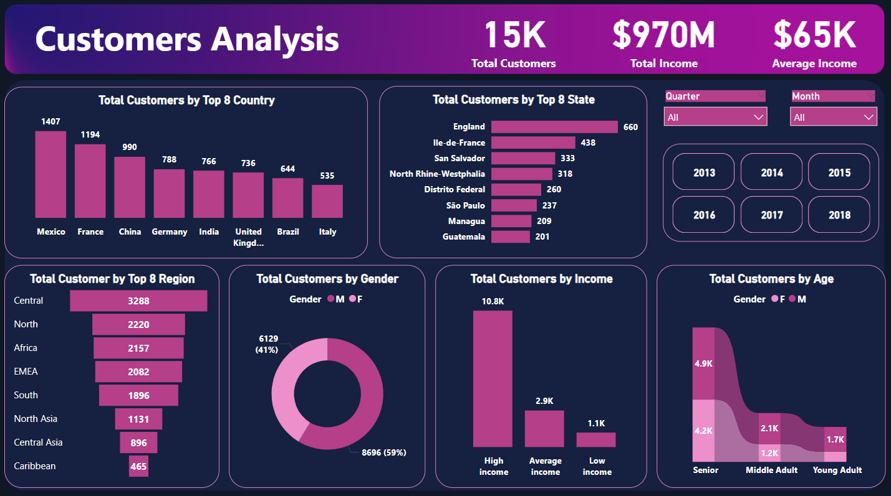
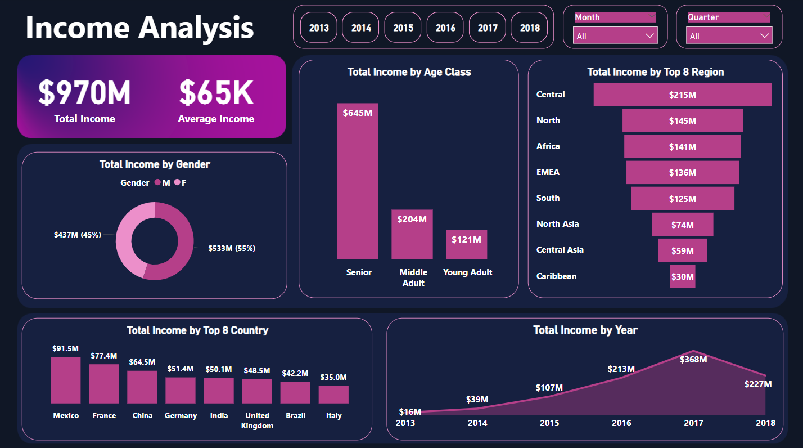
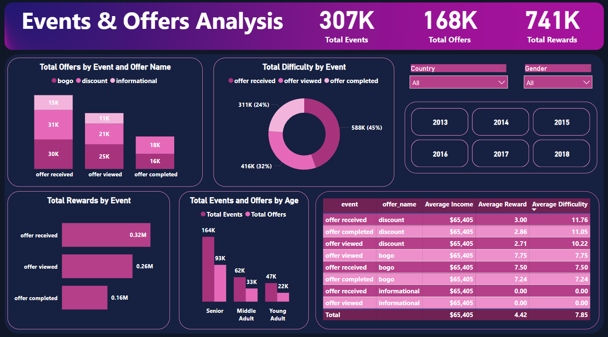

# PowerBI-CafeRewardsDashboards

## 📌 Introduction

This project analyzes customer engagement with marketing offers (BOGO, Discount, Informational) across demographics, income, region, and time. The dashboards reveal which offers, age groups, genders, channels, regions, and dates drive the most engagement and rewards, helping optimize marketing strategies

---

## 📂 Dataset Overview

### **Customer Table**
- `customer_id`: Unique customer identifier  
- `Date_Became_member`: Date the customer joined  
- `gender`: Male or Female  
- `age`: Customer age  
- `income`: Customer income  
- `Country`, `State`, `Region`: Location details  

### **Event Table**
- `customer_id`: Customer identifier  
- `event`: Event type (offer received, viewed, completed)  
- `offer_id`: Linked offer identifier  
- `time`: Timestamp of the event  

### **Offers Table**
- `offer_id`: Unique offer ID  
- `offer_type`: Type of offer (bogo, discount, informational)  
- `difficulty`: Minimum spend required to complete the offer  
- `reward`: Reward in dollars for completing the offer  
- `duration`: Number of days to complete the offer  
- `channels`: List of marketing channels used  

---

## 🔧 Data Cleaning & Transformation
- Removed null values using Python.  
- Converted `Date_Became_member` to date format.  
- Cleaned `offer_id`, `gender`, and `channels` columns.  
- Created calculated columns to categorize **income** and **age groups**.  
- Measures to calculate:
  - Average income, age, rewards, events  
  - Total income and rewards  
  - Count of customers and events

---

## 📊 Dashboards Overview

### **1. Customer Dashboard**
  
**Goal:** Understand customer demographics and distribution.  
- Total number of customers and their distribution across **Country, State, and Region**.  
- Gender breakdown: number of **male and female** customers.  
- Age distribution: **Senior, Middle Adult, Young Adult**.  
- Income distribution: customers across different income ranges.  
- **Interactive filters**: Year, Month, or custom period to explore different timeframes.  

 
•••••••••••••••••••••••••••••••••••••••
  

### **2. Income Dashboard**
  
**Goal:** Analyze revenue and customer spending patterns.  
- Total and average income per period.  
- Income distribution across **countries and regions**.  
- Income distribution by **offer type** (bogo, discount, informational).  
- Analyze how income trends change over time.  
- **Interactive filters**: Year, Month, or custom period to dynamically view income metrics.  

 
•••••••••••••••••••••••••••••••••••••••
  

### **3. Events & Offers Dashboard**
  
**Goal:** Evaluate customer engagement with marketing offers.  
- Total offers **received, viewed, and completed** per event and offer type.  
- Engagement by **age group** to understand which demographic interacts most.  
- Engagement by **gender and country** to identify responsive customer segments.  
- Relationship between **offer difficulty** and **average reward** across event types.  
- **Interactive filters**: Offer type, channels, and period to analyze trends and campaign effectiveness.  

